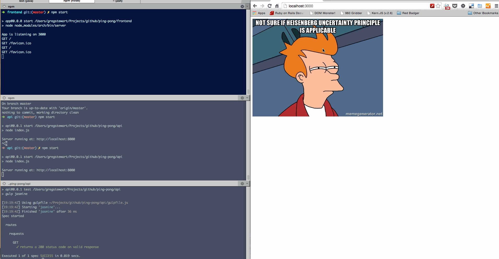

# Introduction

# Ping Pong - a status page app
A very simple app that has the following architecture:

1. an API service built using [Hapi.js](http://hapijs.com/)
2. a Frontend service using [Arch](https://github.com/arch-js/arch)
3. [Nginx](http://nginx.org/) as reverse proxy to forward requests to the frontend and API

The API runs on `http://localhost:8000` and has one endpoint `/ping` which responds with:

```
{
	response: "pong"
}
```


When we are uncertain about the state of the server show this default response: 


Once The Frontend hits `/ping` and when the response is `200` and has `pong` in the response, we render:


If the service fails to respond we render:


The code for app can be found [here](https://github.com/gregstewart/deploying-with-confidence-code). You can start the api with `cd api && npm start` and the front end with `cd frontend && npm start`. The services run on [http://localhost:8000](http://localhost:8000) and [http://localhost:3000](http://localhost:3000) respectively. When you visit the frontend it should after a few seconds render the success view. If you kill the `API` process, then after a few seconds it will render the error view.



I added a simple test for the API code, you can run it using `cd api && npm test`. We will use this to validate our build.


# Building our container
## Creating a Dockerfile

```
# Pull base image.
FROM ubuntu:14.04

# Install.
RUN \
  sed -i 's/# \(.*multiverse$\)/\1/g' /etc/apt/sources.list && \
  apt-get update && \
  apt-get -y upgrade && \
  apt-get install -y build-essential && \
  apt-get install -y curl git man wget nginx supervisor apache2-utils && \
  curl -sL https://deb.nodesource.com/setup | sudo bash - && \
  apt-get -y install nodejs && \
  rm -rf /var/lib/apt/lists/*

# Define mountable directories.
VOLUME ["/etc/nginx", "/var/log/nginx", "/var/www", "/var/log/app"]
```

## Creating the base image
### Installing Node.js
### Installing Nginx
### Installing Supervisor
### Configure volumes

Talk about logging a little

## Tidying things up
`.dockerignore` - you do not want to include things like `.git`

make image as small as possible

## Tag and push image to Docker Hub

# Running the app inside of the container
## Copying our source into the container
## Starting our services using supervisor
### Ensure services run as non-root
## Configuring our machine to browse the site
## Development workflow

# Building our app using Circle
## Configuring Circle to use Docker
## Configuring host entries
## Running the build

We need install and build dependencies inside and out of the container

### Running UTs inside the container
### Running E2E tests outside the container
## Re-building the dependencies

We only want to push an image with production dependencies

## Tag and push to Docker Hub

Now that we have a good build tag and push to `DH`. Using the Circle `SHA`. Checkout the `deploy.sh` script in the trigger deployment section. This here could be the start of the `deploy.sh` script.

# Deploying to AWS
## Setting up ElasticBean stalk

I think there's now a `pure` docker way

## Do battle with permissions for deployment
## Configure Circle
### Only on merge to `master`
### Trigger deployment

Using a `deploy.sh` script

```
#!/usr/bin/env bash

SHA1=$1
# Deploy image to Docker Hub
docker push redbadger/running-rabbit:$SHA1

# Create new Elastic Beanstalk version
EB_BUCKET=running-rabbit
DOCKERRUN_FILE=$SHA1-Dockerrun.aws.json
sed "s/<TAG>/$SHA1/" < Dockerrun.aws.json > $DOCKERRUN_FILE
aws configure set default.region eu-west-1

aws s3 cp $DOCKERRUN_FILE s3://$EB_BUCKET/$DOCKERRUN_FILE

aws elasticbeanstalk create-application-version --application-name running-rabbit \
  --version-label $SHA1 --source-bundle S3Bucket=$EB_BUCKET,S3Key=$DOCKERRUN_FILE

# Update Elastic Beanstalk environment to new version
aws elasticbeanstalk update-environment --environment-name runningrabbit-env \
    --version-label $SHA1
```

# Blue/Green deployments