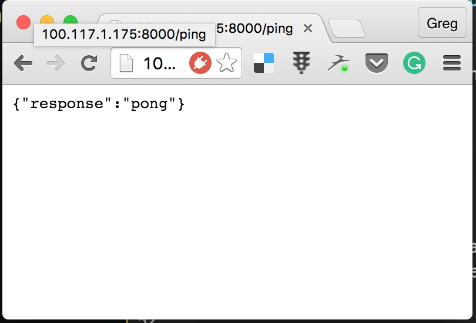

# Introduction

# Ping Pong - a status page app
A very simple app that has the following architecture:

1. an API service built using [Hapi.js](http://hapijs.com/)
2. a Frontend service using [Arch](https://github.com/arch-js/arch)
3. [Nginx](http://nginx.org/) as reverse proxy to forward requests to the frontend and API

The API runs on `http://localhost:8000` and has one endpoint `/ping` which responds with:

```
{
	response: "pong"
}
```


When we are uncertain about the state of the server show this default response:


Once The Frontend hits `/ping` and when the response is `200` and has `pong` in the response, we render:


If the service fails to respond we render:


The code for app can be found [here](https://github.com/gregstewart/deploying-with-confidence-code). You can start the api with `cd api && npm i && npm start` and the front end with `cd frontend && npm i && npm start`. The services run on [http://localhost:8000](http://localhost:8000) and [http://localhost:3000](http://localhost:3000) respectively. When you visit the frontend it should after a few seconds render the success view. If you kill the `API` process, then after a few seconds it will render the error view.


I added a simple test for the API code, you can run it using `cd api && npm test`. We will use this to validate our build.

# Otto
[Otto](https://ottoproject.io/) provides a new way to develop and deploy your code to the cloud.

## Development environment

```
cd api && otto compile && otto dev
```

This sets up our local environment to run our api inside a vagrant image.

```
otto ssh dev
```

Allows you to ssh on to the vagrant image. To run the app inside of the container:

```
vagrant@precise64:/vagrant$ npm rebuild && npm start
```

And we can find the IP of our vagrant instance by typing:

```
otto dev address
```

And you should now be able to browse the API. On my machine that means going to `http://100.117.1.175:8000/ping`



With that our environment is set up and running

## Deploy to production

`otto infra` sets up much of the configuration getting you ready to deploy your infrastructure using [Terraform](https://terraform.io/). 
